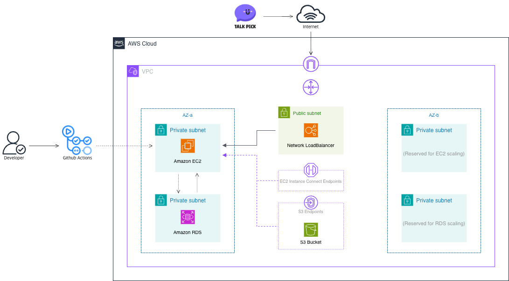
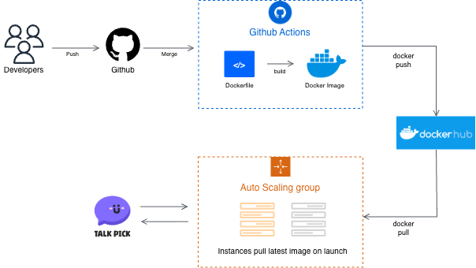

# Talkpick-infra

### Overview
AWS 기반 인프라를 모듈 단위로 분리하여 관리하기 위한 Terraform 레포지토리입니다.
각 모듈은 루트 모듈에서 실행 가능합니다.

### 🏛️ AWS Cloud InfraStructure 
> 런타임 인프라 구조

  

### CICD InfraStructure
> CICD 인프라 구조

  

